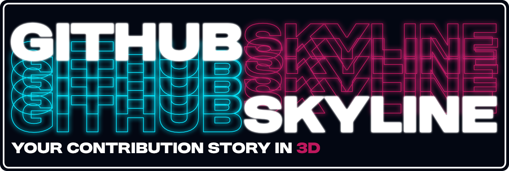

<div align="center">
    <a href="https://gh-skyline.pages.dev">
        
    </a>
    <hr />
    <a href="https://github.com/battlesquid/gh-skyline/stargazers">
        
    </a>
    <a href="../LICENSE">
        
    </a>
</div>

<br>

## Motivation

Around the end of 2024, I went to https://skyline.github.com to print my Github
Skyline; I already had one for 2023, and I wanted to grow my collection. Lo and
behold, the app is offline.

At the time, there were some alternatives, but I didn't like their style
compared to the original skyline. Github had also recently come out with a
[CLI version](https://github.com/github/gh-skyline). My main gripe was that I
didn't want to install the Github CLI just to get my skyline. I liked the idea of being able to view/print my skyline from wherever as long as I had a browser.

And so here we are!

## Features

- Highly customizable, parameter-based model editor with options to change
  username text, font, tower size, base shape, and more.
- Ability to generate multi-year skylines
- Performant, changes are applied in real-time
- 3MF support (can export model with colors for multi-extruder printers)
- Cloud Enterprise authentication support

## Stack

- UI: [React](https://react.dev/), [Mantine](https://mantine.dev/)
- 3D: [three.js](https://threejs.org/), [@react-three/fiber](https://r3f.docs.pmnd.rs/getting-started/introduction) (and related `@react-three` libraries), [manifold](https://github.com/elalish/manifold)
- OAuth: [Cloudflare Workers](https://workers.cloudflare.com/)
- Routing: [Tanstack Router](https://tanstack.com/router/latest)
- Build: [Rsbuild](https://rsbuild.rs/)

## Local Development

This project uses [volta](https://volta.sh). It's **highly recommended** that you also use volta to stay in sync with the project's tool dependencies (plus it's a great tool regardless), but if you prefer not to, just ensure your tools and its versions are in sync with whats listed in the `package.json` in the `volta` field.

Install the dependencies:

```bash
pnpm i
```

Start the dev server:

```bash
pnpm dev
```

Keep things tidy:

```bash
pnpm neat:fix
```

## Acknowledgements
- Big thanks to [@justinfernald](https://github.com/justinfernald), who contributed many key features, improvements, and ideas throughout development.
- 3MF exporting with color support is made possible by [LittleSound](https://github.com/LittleSound) and their package [three-3mf-exporter](https://github.com/LittleSound/bekuto3d/tree/main/packages/three-3mf-exporter).
- [gr2m](https://github.com/gr2m)'s [Github OAuth worker](https://github.com/gr2m/cloudflare-worker-github-oauth-login) is the base for the skyline worker.


## Licensing

This project is licensed under [GPL 3.0](../LICENSE), with the exception of the
following components:

- [`@skyline/worker`](../packages/worker/): ISC
